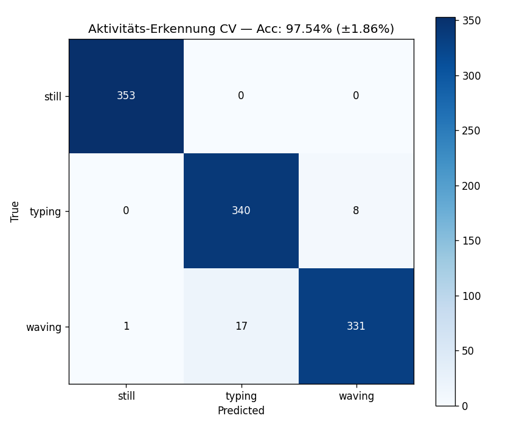

# 📡 WiFi-Sensing mit ESP32-C6: Aktivitäts-Erkennung


> Passive Erkennung menschlicher Aktivitäten allein durch WiFi-Channel-State-Information (CSI) — ohne Kamera, ohne Mikrofon, ohne Wearables.





**Live-Demo erkennt 3 Aktivitäten am Schreibtisch:**

- 🧘 **STILL** — Hände im Schoß, nur Atmen

- ⌨️ **TYPING** — Aktives Tippen auf der Tastatur

- 👋 **WAVING** — Hand winkt über der Tastatur


**Genauigkeit: 97.5 % (5-Fold Cross-Validation)**


---


## 🎯 Was ist WiFi-Sensing?


Funkwellen werden von Menschen, Möbeln und Wänden reflektiert. Die **Channel State Information (CSI)** beschreibt, wie sich das Signal pro WiFi-Subcarrier verändert — sie ist im Prinzip ein "Funk-Fingerabdruck" des Raums.


Wenn eine Person sich bewegt, ändert sich diese Signatur charakteristisch. Mit Machine Learning lassen sich verschiedene Bewegungsmuster trennen.


**Anwendungsbereiche (kommerziell):** Origin Wireless, Cognitive Systems, Aerial Technologies — Präsenz-Erkennung, Sturzdetektion, Atemfrequenz-Monitoring.


---


## 🔧 Hardware


| Komponente | Modell | Funktion |

|------------|--------|----------|

| 2× ESP32-C6 | Waveshare ESP32-C6-WROOM-1-N8 | Sender (TX) und Empfänger (RX) |

| 2× USB-C-Kabel | Datenkabel | Power + Serial |

| 1× Laptop | Windows 10/11 | Daten verarbeiten + Modell |


**Gesamtkosten: \~25 €**


---


## 🏗️ Architektur


```

┌─────────────┐     ESP-NOW Pakete (100 Hz)      ┌─────────────┐

│  TX-Board   │  ━━━━━━━━━━━━━━━━━━━━━━━━━━━ →   │  RX-Board   │

│  (csi_send) │       Channel 11, 2.4 GHz        │  (csi_recv) │

└─────────────┘                                  └──────┬──────┘

                                                        │ Serial @ 921600

                                                        â–¼

                                  ┌─────────────────────────────┐

                                  │   Python (Laptop)            │

                                  │  ┌───────────────────────┐  │

                                  │  │ CSI-Parser → Buffer   │  │

                                  │  │ Feature Extraction    │  │

                                  │  │ RandomForest Modell   │  │

                                  │  │ Flask + Browser       │  │

                                  │  └───────────────────────┘  │

                                  └─────────────────────────────┘

```


---


## 📂 Projektstruktur


```

.

├── 1_record_csi.py             # CSI-Daten aufzeichnen mit Label

├── 2_diagnose.py               # Statistik pro Aufnahme prüfen

├── 3_train_activity.py         # ML-Modell trainieren (Random Forest)

├── 4_live_activity.py          # Konsolen-Live-Inferenz

├── 5_dashboard_backend.py      # Flask-Server

├── 5_dashboard_frontend.html   # Browser-Dashboard

├── live_heatmap.py             # Live-Heatmap zum Debuggen

├── analyze_log.py              # Log-Files auswerten

├── rf_model_activity.pkl       # Trainiertes Modell

└── requirements.txt

```


---


## 🚀 Setup (Windows)


### 1. ESP32-C6 vorbereiten


Diese Anleitung setzt voraus, dass [ESP-IDF v5.4](https://docs.espressif.com/projects/esp-idf/en/v5.4/esp32c6/get-started/) installiert ist.


**TX-Board flashen:**

```powershell

git clone https://github.com/espressif/esp-csi.git

cd esp-csi/examples/get-started/csi_send

idf.py set-target esp32c6

idf.py -p COM3 flash

```


**RX-Board flashen:**

```powershell

cd ../csi_recv

idf.py set-target esp32c6

idf.py -p COM5 flash

```


> COM-Ports unter Windows mit Geräte-Manager prüfen. Treiber: [CH343SER](https://www.wch-ic.com/downloads/CH343SER_EXE.html).


### 2. Python-Umgebung


```powershell

python -m venv venv

.\\venv\\Scripts\\Activate.ps1

pip install -r requirements.txt

```


### 3. Daten aufnehmen


```powershell

python 1_record_csi.py still 120     # 2 Min still sitzen

python 1_record_csi.py typing 120    # 2 Min tippen

python 1_record_csi.py waving 120    # 2 Min winken

```


### 4. Modell trainieren


```powershell

python 3_train_activity.py

```


Erzeugt `rf_model_activity.pkl` und `confusion_matrix_activity.png`.


### 5. Live-Dashboard starten


```powershell

python 5_dashboard_backend.py

```


Im Browser öffnen: **http://localhost:5000**


Vom Handy (gleiches WLAN): `http://<PC-IP>:5000`


---


## 📊 Methodik


### Feature-Extraktion


Pro Sliding-Window (90 Pakete = 1 Sek) werden 320 Features pro Sample extrahiert:


- **Std pro Subcarrier** — zeitliche Variation

- **Mean Absolute Difference** — Änderungsrate

- **Std der Differenzen** — Variabilität der Änderungen

- **Perzentil-Range (P90 − P10)** — robuster Range

- **Mean Absolute Beschleunigung** — 2. Ableitung


Diese Features sind **kalibrationsunabhängig** — absolute Amplitudenpegel werden bewusst nicht verwendet, da der ESP32 die AGC laufend anpasst.


### Validierung


**Time-Based 5-Fold Cross-Validation** statt zufälligem Split. Innerhalb jeder Klasse werden die Windows zeitlich in 5 Blöcke geteilt — so wird verhindert, dass zeitnah aufeinanderfolgende Windows in beide Sets gelangen (Data Leakage).


### Ergebnisse


| Klasse | Precision | Recall | F1 |

|--------|-----------|--------|-----|

| still  | 1.00 | 1.00 | 1.00 |

| typing | 0.95 | 0.98 | 0.96 |

| waving | 0.98 | 0.95 | 0.96 |


**Gesamtgenauigkeit: 97.54 % (± 1.86 %)**


---


## ⚠️ Bekannte Limitierungen


1\. **Inter-Session-Drift** — Der WiFi-Kanal ändert sich über Stunden hinweg (AGC-Rekalibrierung, andere Geräte, Multipath). Ein Modell, das heute trainiert wurde, funktioniert morgen möglicherweise nicht mehr. Lösung: **On-Site-Retraining** vor jedem Demo-Session.


2\. **Setup-Sensitivität** — Werden die Boards verschoben, muss neu trainiert werden.


3\. **Klassen-Trennbarkeit** — `still` vs. `typing` haben sehr ähnliche TempVar; das Modell unterscheidet sie durch subtile Subcarrier-spezifische Muster. In anderen Umgebungen evtl. schwieriger.


---


## 🔬 Wissenschaftlicher Kontext


Inspiriert durch die IEEE 802.11bf Standardisierung (WiFi-Sensing) und akademische Arbeiten zu CSI-basierter Aktivitätserkennung (z.B. *EI* von Microsoft Research, *FALL-Sense*, *WiCount*).


---


## 📝 Lizenz


MIT


---


## 🙏 Credits


- **esp-csi** von [Espressif](https://github.com/espressif/esp-csi) — CSI-Firmware

- ESP32-C6-Hardware: [Waveshare](https://www.waveshare.com/wiki/ESP32-C6-WROOM-1)

